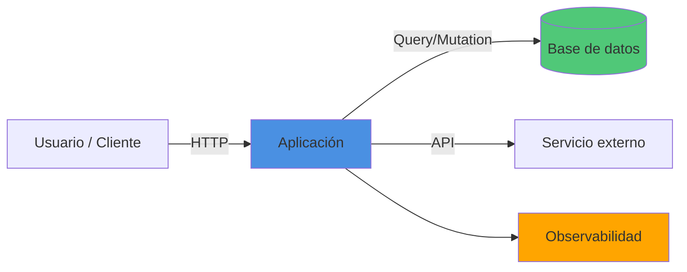

# spec-docs — Especificación y documentación del proyecto

Skill **genérica y reutilizable**. No asume dominio, framework ni base de datos:
todo se **deriva** del repositorio. Produce/actualiza **dos artefactos canónicos**
y un **manifiesto de entregables** que los conecta:

| Archivo | Rol | Audiencia |
|---|---|---|
| `PROMPT.md` | El **QUÉ**: contrato de especificación del producto | Humanos / product |
| `AGENTS.md` | El **CÓMO**: instrucciones operativas para agentes de código | Agentes / devs |

Regla rectora: **no dupliques contenido entre los dos.** `PROMPT.md` define
requisitos y criterios de aceptación; `AGENTS.md` define comandos, convenciones y
flujo de trabajo. Cada entregable de la lista aparece como *requisito* en
`PROMPT.md` y como *tarea operativa con comandos* en `AGENTS.md`.

## Principio de generalidad (leer primero)
- **No hardcodees el dominio.** Las "intenciones originales" se extraen leyendo el
  `PROMPT.md` actual, no de esta skill. Si el PROMPT.md no lo dice, no lo inventes:
  márcalo como `TODO` o pregunta.
- **No asumas el stack.** Detecta framework, scripts, BD, auth y servicios externos
  desde `package.json`/lockfile/`requirements.txt`/`go.mod`/`Dockerfile`, etc.
- **Secciones condicionales.** Bloques como "BD", "seed", "pasarela de pago" o
  "email" solo aparecen si el proyecto realmente los usa.

## Cuándo usarla
- Al arrancar el proyecto (PROMPT.md redactado/mínimo, AGENTS.md inexistente).
- Cuando cambie el alcance y haya que re-sincronizar la especificación.
- Antes de una entrega, para verificar que el manifiesto de entregables esté completo.

## Workflow

### Paso 0 — Leer el estado actual (descubrimiento, no suposición)
1. Lee `PROMPT.md`, `CLAUDE.md`/`AGENTS.md` (si existen) y el `README.md`.
2. Lista la raíz del repo y detecta qué entregables ya existen (ver checklist abajo).
   Nunca regeneres un archivo que ya tenga contenido real.
3. Detecta el **stack real**:
   - Node: `package.json` → framework, `scripts`, dependencias. Deriva los comandos
     reales (`dev`, `build`, `start`, `test`); **no inventes** scripts inexistentes.
   - Otros ecosistemas: `requirements.txt`/`pyproject.toml`, `go.mod`, `pom.xml`, etc.
   - Base de datos / ORM / driver, sistema de auth, pasarela de pago, email, colas,
     y cualquier servicio externo presente en dependencias o variables de entorno.
4. Extrae del `PROMPT.md` la **lista de intenciones originales** (los requisitos que
   el humano ya escribió). Esa lista es la que debes preservar sin contradecir.

### Paso 1 — Mejorar `PROMPT.md`
Reescribe `PROMPT.md` **preservando todas las intenciones originales detectadas en
el Paso 0** y expándelo con esta estructura. Rellena cada sección con lo derivado
del repo; lo que no se pueda derivar va como `TODO`.

```markdown
# [Nombre del proyecto] — Especificación

## 1. Objetivo
Una frase de producto + el problema que resuelve.

## 2. Alcance
- Incluido (MVP): ...
- Fuera de alcance (por ahora): ...

## 3. Stack tecnológico
- Backend / Frontend / Auth / BD / Servicios externos (solo los que apliquen).
- Justifica cada elección en una línea. Refleja el stack REAL detectado.

## 4. Requisitos funcionales
RF-01 ... RF-NN (cada uno verificable y con criterio de aceptación).
Deben cubrir, como mínimo, todas las intenciones del PROMPT.md original.

## 5. Requisitos no funcionales (medibles)
Cada uno con su OBJETIVO numérico, porque luego se mide (ver §8):
- Latencia API p95 < X ms.
- Tiempo de respuesta de la BD p95 < X ms por operación clave (si hay BD).
- Accesos concurrentes soportados ≥ N usuarios sin degradación > Y%.
- Tamaño máximo esperado por entidad y por colección/tabla (si hay BD).
- Disponibilidad objetivo, RPO/RTO si aplica.

## 6. Modelo de datos (si hay BD)
Entidades/colecciones/tablas, ejemplos, índices previstos, tamaño estimado.

## 7. Entregables documentales (OBLIGATORIOS)
Tabla con estado de cada entregable del manifiesto (§ "Manifiesto" de la skill).

## 8. Métricas y observabilidad
Qué se mide, cómo se mide, y los umbrales de §5.

## 9. Deployment público
Entorno objetivo, dominio, secretos/variables, estrategia (ver AGENTS.md para comandos).

## 10. Criterios de aceptación del proyecto
Checklist de "hecho": todos los entregables presentes + tests en verde + CI en verde.
```

### Paso 2 — Generar `AGENTS.md`
Crea/actualiza `AGENTS.md` con instrucciones **operativas y ejecutables**. Las
instrucciones de **instalación, arranque del sistema y de la BD/servicios deben ir
arriba del todo y muy visibles** (primeras secciones, con bloques de comandos).
Adapta los comandos al stack real; incluye solo las secciones que apliquen.

```markdown
# AGENTS.md — Guía operativa de [Nombre del proyecto]

> Especificación del producto: ver `PROMPT.md`. Este archivo es el "cómo".

## 🚀 Instalación (paso a paso)
```bash
# 1. Dependencias  → genera/usa el lockfile (en CI: instalación reproducible)
<gestor> install
# 2. Variables de entorno
cp .env.example .env   # configurar las variables del proyecto
```

## 🗄️ Servicios locales (solo si aplica: BD, email, colas...)
```bash
# Ej. base de datos vía Docker
docker run -d --name <svc> -p <puerto>:<puerto> <imagen>
```
Variables clave y, si hay BD, índices a crear.

Aprovisionar datos de ejemplo (seed) para dev/test/demo (si hay BD):
```bash
<gestor> run seed          # inserta datos de ejemplo + índices
<gestor> run seed:reset    # limpia y re-siembra
```

## ▶️ Arranque del sistema
```bash
<gestor> run dev     # desarrollo
<gestor> run build && <gestor> start   # producción
```

## ✅ Tests
```bash
<gestor> test            # suite completa
<gestor> run test:watch  # desarrollo
<gestor> run test:cov    # cobertura
```
Política: cada RF de PROMPT.md tiene ≥1 test. PR sin tests no se mergea.

## 🧱 Estructura del proyecto
(árbol de carpetas y qué vive en cada una)

## 🧭 Convenciones
Estilo de código, naming, commits, manejo de errores, acceso a datos.

### CSS / Layout (si el proyecto usa Tailwind v4 o cualquier framework con CSS Cascade Layers)
Tailwind v4 genera sus utilities dentro de `@layer utilities`. Todo CSS escrito **fuera** de un
`@layer` en el mismo fichero tiene mayor prioridad en la cascada, independientemente de la
especificidad del selector. Esto significa que un reset global como `* { margin: 0; padding: 0; }`
**anula** utilidades de margen como `mx-auto`, rompiendo el centrado de contenido.

**Reglas obligatorias**:
1. En `globals.css` (o equivalente) usar **solo** `*, *::before, *::after { box-sizing: border-box; }`
   fuera de capas. El preflight de Tailwind ya resetea márgenes y paddings — no duplicar.
2. Para centrar contenido, usar siempre el patrón **contenedor exterior ancho completo +
   `<div>` interior centrado**, igual que hace la Navbar:
   ```tsx
   // ✅ Correcto
   <main>
     <div className="max-w-7xl mx-auto px-6 py-8">{children}</div>
   </main>

   // ❌ Incorrecto con Tailwind v4 si hay CSS fuera de @layer
   <main className="max-w-7xl mx-auto px-6 py-8">{children}</main>
   ```
3. Si se necesita añadir CSS personalizado que use las mismas propiedades que las utilities,
   envolverlo en `@layer utilities { ... }` para no romper la jerarquía de capas.

## 📊 Métricas (cómo recolectarlas)
Comandos/endpoints para medir latencias, tiempos de BD y concurrencia, y dónde se
registran (ver PROMPT.md §5/§8).

## 🌐 Deployment público
Pasos concretos, secretos, pipeline CI, rollback.

## 📒 Documentación viva (obligación del agente)
Tras cada cambio relevante: actualizar README/QUICKSTART si cambia el arranque,
registrar problemas+soluciones en RETROSPECTIVA.md.
```

### Paso 3 — Manifiesto de entregables
Inserta esta tabla **en PROMPT.md §7** y mantenla como fuente de verdad. Marca el
estado real detectado en el Paso 0. Adapta las filas condicionales (seed, etc.).

| Entregable | Propósito | Estado |
|---|---|---|
| `README.md` | Visión general, instalación, arranque, arquitectura resumida | ⬜ |
| `QUICKSTART.md` | Camino mínimo "de cero a corriendo" en < 5 min | ⬜ |
| `RETROSPECTIVA.md` | Bitácora **problema → causa → solución** (entrada por incidente) | ⬜ |
| `REFLEXION-FINAL.md` | Cierre: qué se logró, decisiones, deuda técnica, aprendizajes | ⬜ |
| Tests automatizados | ≥1 por RF; unitarios + integración + e2e clave | ⬜ |
| Seed de datos (si hay BD) | Aprovisiona datos de ejemplo (dev/test/demo) | ⬜ |
| `.env.example` | Plantilla de variables de entorno | ⬜ |
| Lockfile (`package-lock.json`/equivalente) | Dependencias bloqueadas, commiteado | ⬜ |
| Pipeline CI (`.gitlab-ci.yml` / `.github/workflows/*`) | install → lint → test → build → deploy | ⬜ |
| Diagrama de arquitectura | En README (Mermaid): componentes y flujos | ⬜ |
| Sección de métricas | Latencias, respuesta de BD, tamaño de objetos, concurrencia | ⬜ |
| Guía de deployment público | Detallada, reproducible, con secretos y rollback | ⬜ |

#### Generación de stubs
Para cada entregable documental que **no exista**, crea un **stub esqueleto** con
sus secciones y marcadores `TODO` / `<!-- TODO -->`, sin inventar contenido.
Nunca regeneres un archivo que ya tenga contenido real. (El lockfile no se stubea:
lo genera el instalador de dependencias.)

### Paso 4 — Diagrama de arquitectura
El diagrama va en `README.md` con Mermaid y debe mostrar **todos los componentes
principales** y cómo se comunican: usuario/cliente, capas de aplicación
(frontend/backend/workers/crons), almacenamiento (BD/caché/storage), servicios
externos (email, pagos, auth, terceros) y observabilidad. Plantilla mínima:



**Checklist del diagrama**:
- [ ] Todos los flujos de datos están representados.
- [ ] Se muestran direcciones de comunicación (→ / ↔) y protocolos relevantes.
- [ ] Se distinguen componentes internos (colores) de externos.
- [ ] Es legible en una sola pantalla (máx. 5-7 elementos principales).

### Paso 5 — Deployment público
**En PROMPT.md §9 (qué)**: entorno objetivo, plataforma, dominio(s), estrategia de
actualización (rolling/blue-green/canary), ventana de mantenimiento, RPO/RTO,
backup/disaster recovery.

**En AGENTS.md (cómo)**:
```bash
# Prerequisitos: variables de producción, secretos en gestor de secretos,
# BD aprovisionada, DNS apuntando a la infraestructura.

# Deployment
<gestor> run build
<gestor> run deploy:prod

# Rollback
git revert <commit> && git push

# Verificación post-deployment
curl https://tudominio.com/health
```
Cubrir: secretos/configuración por entorno, migraciones/backup de BD, build,
deployment, verificación (health checks/smoke tests), rollback y monitoreo.

### Paso 6 — Métricas a prever para producción
PROMPT.md §5/§8 y AGENTS.md deben cubrir **como mínimo**:
- **Performance operativa**: throughput (req/s), uso CPU/memoria.
- **Latencias**: p50/p95/p99 de endpoints clave.
- **Tiempos de respuesta de la BD** (si hay): por operación y por índice.
- **Tamaño de los objetos**: bytes por entidad y por colección/tabla, crecimiento.
- **Accesos concurrentes**: usuarios/conexiones simultáneas y punto de degradación.
- **Otras útiles**: tasa de error, pool de conexiones, cold start, costo, uptime.

## Criterios de calidad (auto-verificación antes de terminar)
- [ ] PROMPT.md preserva TODAS las intenciones originales y no contradice nada.
- [ ] PROMPT.md y AGENTS.md no se duplican (QUÉ vs CÓMO).
- [ ] Instalación, arranque y servicios están arriba y muy visibles en AGENTS.md.
- [ ] Cada métrica pedida tiene un objetivo numérico en PROMPT.md.
- [ ] El manifiesto refleja el estado REAL del repo (verificado, no asumido).
- [ ] Comandos derivados del stack real, no inventados.
- [ ] Secciones condicionales (BD/seed/pagos/email) solo si el proyecto las usa.
- [ ] Si usa Tailwind v4 u otro framework con CSS Layers: `globals.css` no tiene resets de
  `margin`/`padding` fuera de `@layer`; el patrón de layout usa contenedor exterior + `<div>`
  interior centrado (no `mx-auto` directamente en elementos semánticos).
- [ ] Tras correr la skill, resumir al usuario qué falta del manifiesto.

## Repositorios y subida del proyecto
Una vez probado el proyecto y validado que el pipeline CI/CD pasa, los tests pasan
al 100%, el build genera artefactos sin errores y todos los entregables están
presentes, el proyecto se sube a ambos repositorios:

| Repositorio | URL |
|---|---|
| **GitHub** | `https://github.com/OSCARJORGERAPP/[nombreDelProyecto]` |
| **GitLab** | `https://gitlab.codecrypto.academy/ojrapp/[nombreDelProyecto]` |

**Requisitos antes de subir**:
- `.gitlab-ci.yml` presente y configurado (pipeline lint → test → build → deploy).
- Sin errores en el pipeline; tests al 100%; build sin warnings críticos.
- PROMPT.md, AGENTS.md y todos los entregables completos.
- `.gitignore` configurado (node_modules, .env, secretos, etc.) y lockfile commiteado.

**⚠️ SINCRONIZACIÓN OBLIGATORIA**: todas las correcciones, commits y cambios se
suben a **AMBOS** repositorios. GitHub y GitLab deben estar siempre en sincronía;
la fuente de verdad es el local y cada push a main/master se replica en ambos remotes.
