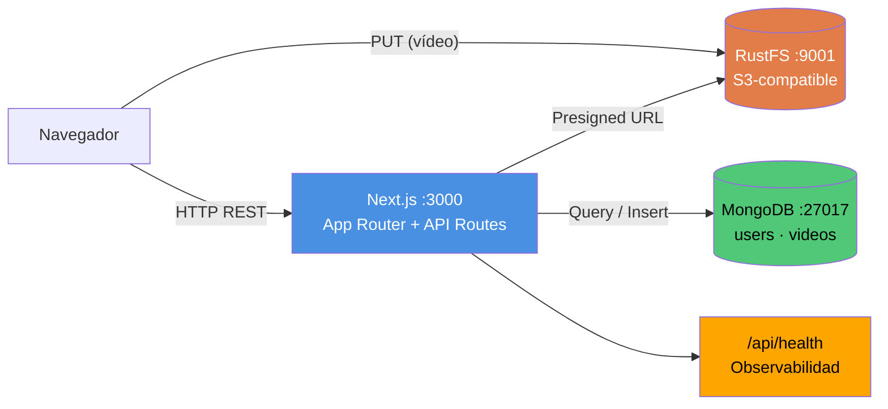

# VideoVault

Plataforma privada de gestión y reproducción de vídeos. Cada usuario sube, organiza y busca sus propios vídeos con metadatos ricos (tags, pares clave-valor, descripción). Reproductor HTML5 integrado.

## Arquitectura



## Instalación rápida

```bash
npm install
cp .env.example .env   # ajusta JWT_SECRET
docker run -d --name mongodb -p 27017:27017 mongo:7
docker run -d --name rustfs -p 9000:9000 -p 9001:9001 \
  -e RUSTFS_ROOT_USER=rustfsadmin -e RUSTFS_ROOT_PASSWORD=rustfsadmin \
  -v rustfs_data:/data rustfs/rustfs server /data
npm run dev
```

Ver [QUICKSTART.md](QUICKSTART.md) para la guía paso a paso completa.
Ver [AGENTS.md](AGENTS.md) para comandos operativos detallados.
Ver [PROMPT.md](PROMPT.md) para la especificación del producto.

## Stack

- **Frontend/Backend**: Next.js 15 (App Router, API Routes)
- **Estilos**: Tailwind CSS v4
- **Base de datos**: MongoDB 7 (driver nativo)
- **Storage**: RustFS (S3-compatible)
- **Auth**: JWT en httpOnly cookie

## Scripts

```bash
npm run dev        # Desarrollo
npm run build      # Build de producción
npm start          # Servidor de producción
npm test           # Tests
npm run test:cov   # Tests con cobertura
npm run lint       # Lint
```

## Variables de entorno

Ver `.env.example`. Nunca commitear `.env`.

## Deployment

<!-- TODO: completar con plataforma, dominio y pasos post-MVP -->

## Licencia

<!-- TODO -->
